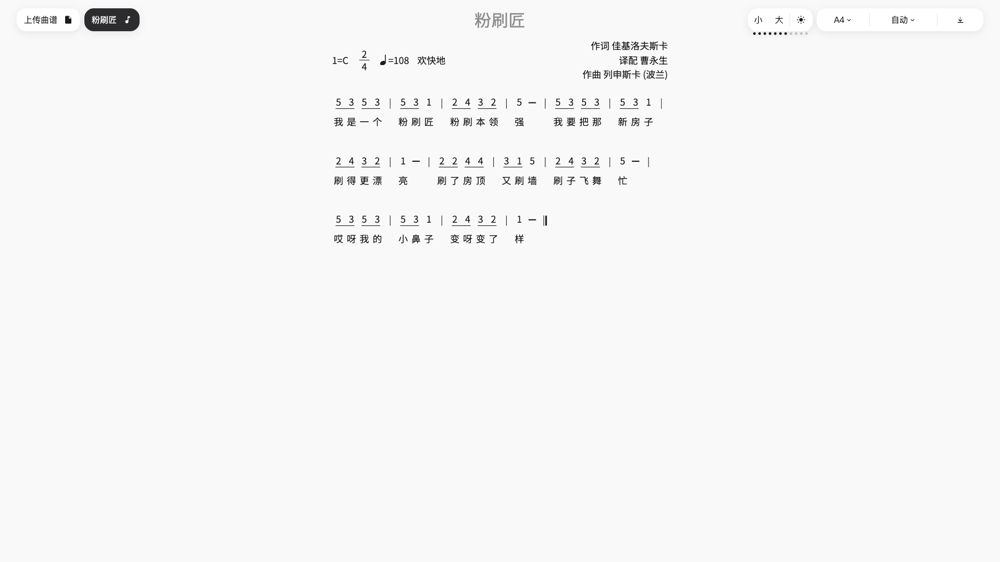
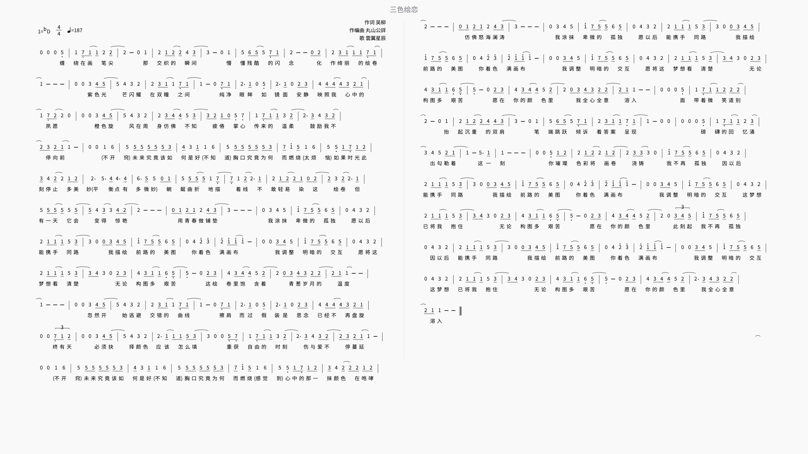
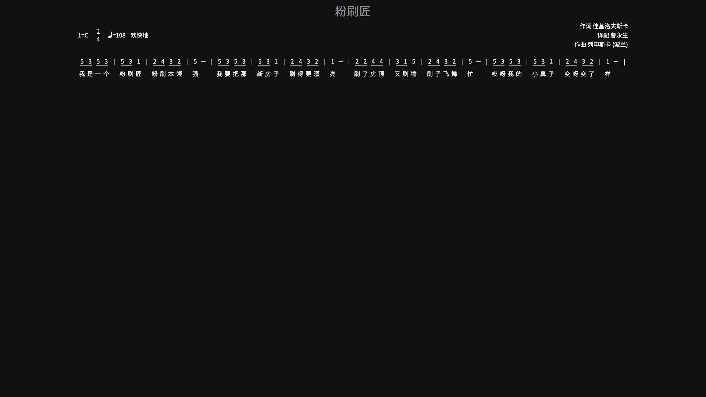
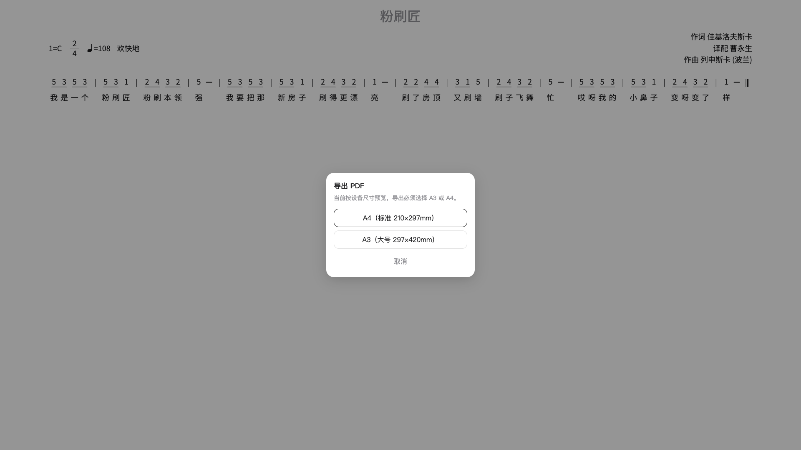
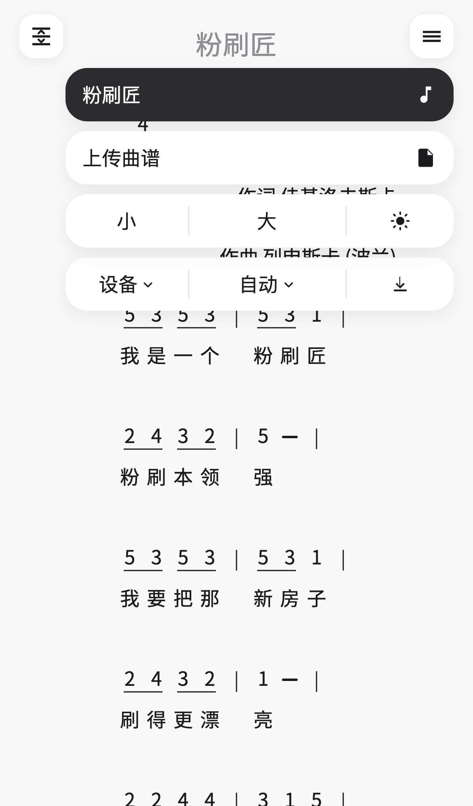
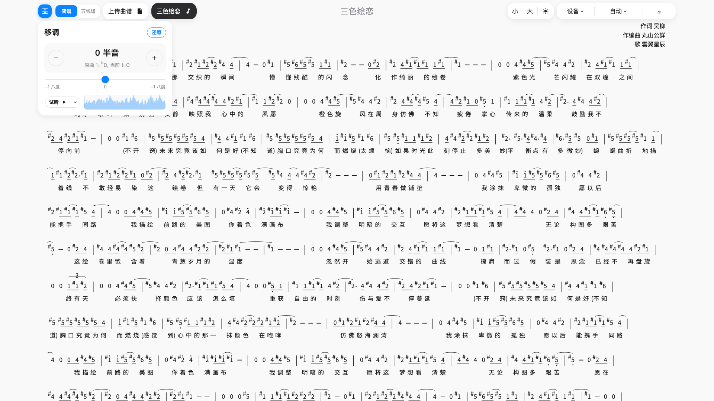
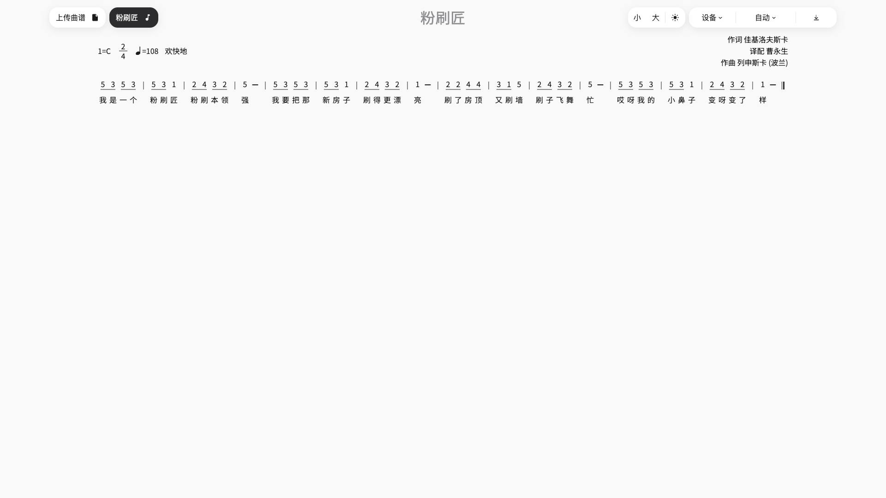
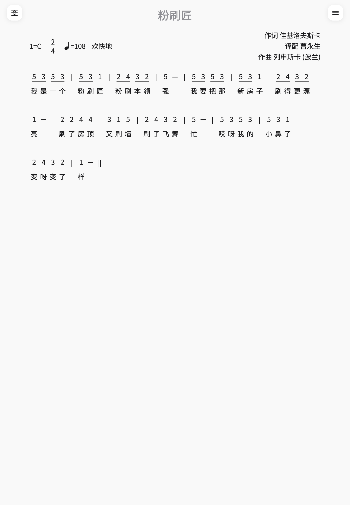
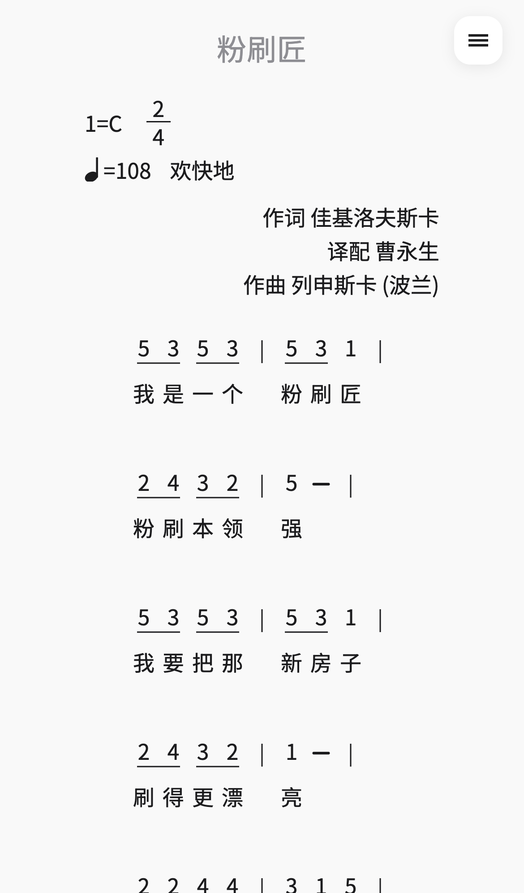

# xml2jianpu

将 [MusicXML](https://www.w3.org/2021/06/musicxml40/) 转为简谱的网页应用：打开即可预览，也可导出 PDF。

## 在线访问

- [GitHub Pages](https://sunbeamhub.github.io/xml2jianpu/)（国际访问）
- 腾讯云 EdgeOne Makers：部署后使用控制台给出的默认域名（大陆访问）

## 功能特性

打开站点后，桌面端把指针移到标题栏即可看到全部控件；平板和手机点左上角移调、右上角菜单。


- **上传曲谱**：选择本地 `.musicxml` / `.xml` 文件，即时排成简谱。
- **内置示例**：按专辑分组（儿歌、三色绘恋等），可直接切换曲目。
- **纸张大小**：默认「设备」跟随当前屏宽；也可预览 A4 / A3（导出用这两种规格）。

  

- **换行**：自动（按纸宽估算每行小节）、原谱换行，或固定每行 2–6 小节。
- **响应式多列布局**：桌面端按视口自动分栏（最多 4 列），让长谱尽量落在一屏内；平板和手机保持单列。窗口宽高变化时桌面会重新分栏；「设备」模式下宽度变化会按当前屏幕重排。下图为 2560×1440（2K）下《三色绘恋》的排版。

  

- **字号**：标题栏「小 / 大」调节唱名与歌词大小（点按后会出现当前档位圆点）。

  

- **主题**：浅色、深色，或跟随系统。

  

- **缩放与平移**：桌面用 Ctrl/Cmd + 滚轮（触控板捏合也会走这条）；平板和手机用双指捏合。放大后可横向拖动，纵向仍用页面滚动。

  

- **导出 PDF**：纸张已是 A3/A4 时直接导出；当前为「设备」预览时，会先弹出纸张选择。导出为矢量 PDF，按「唱名 + 歌词」整组分页，不会把一行拆到两页。

  

- **移动端菜单**：平板和手机用右上角按钮打开功能面板。

  

- **固定调移调**：桌面端标题栏左侧、平板和手机左上角（与右上角菜单对称）打开移调面板。进入后唱名按 `1=C` 重写，适合按 C 大调演奏；可用加减或滑杆按半音升降（上下限各一个八度），并一键还原原谱。谱面相对原谱有改动时图标会高亮。此状态只在当前会话有效，换谱或刷新后回到 MusicXML 原调；导出 PDF 会使用当前移调后的谱面。

  

- **谱头信息**：调号（`1=`）、拍号、速度、表情术语，以及作词 / 译配 / 作曲。
- **简谱记谱**：唱名与歌词对齐；时值下划线按拍分组；八度高低点、升降号与还原、音符、小节线与终止线、附点、延音线、连线、休止符；未写 accidental 时按调号给出默认升降。
- **偏好记忆**：当前曲目、纸张、换行、字号、主题和上次导出纸张会记在浏览器本地，下次打开沿用。
- **PWA**：可安装到主屏幕，以独立窗口打开；首次联网访问后会缓存界面、简谱字体和内置示例，之后离线也能查看示例并导出 PDF。本地上传的曲谱只存在于当前会话，刷新或重新打开后不会保留。

## 安装与离线

在 Chrome、Edge、Safari 等浏览器中，可用「安装应用」或「添加到主屏幕」把本站装成本机应用。

1. **第一次打开需要联网**，以便缓存 App、Noto Sans SC 字体和内置示例曲谱。
2. 之后即使断网，也可打开应用、切换内置示例并导出 PDF。
3. 用户自己上传的 MusicXML **不会**写入离线缓存：关掉页面或刷新后需要重新选择文件。

GitHub Pages（`/xml2jianpu/`）与 EdgeOne（站点根路径）会各自生成对应 `publicPath` 的 Service Worker，安装范围互不影响。

## 系统与浏览器兼容

面向现代浏览器构建（modern + legacy 双包），**不支持 Internet Explorer**。各平台向下兼容大致如下：

- **iOS**：11 及以上（Safari）。iOS 11–12 可预览与解析曲谱；导出 PDF 时可能需按应用内引导手动保存。
- **iPadOS**：13 及以上。更早的 iPad（仍称 iOS、版本 11–12）同样在支持范围内。
- **macOS**：Safari 11 及以上，约对应 macOS 10.12（Sierra）及更新；也可用本机 Chrome / Edge / Firefox。
- **Android**：建议 Android 8+，使用较新的 Chrome / Edge / Firefox；系统自带 WebView 过旧时可能异常。
- **Windows**：Windows 10+ 上的 Chrome / Edge / Firefox；不支持 Internet Explorer。
- **Linux**：近两年常见发行版上的 Chrome / Chromium / Firefox。

极旧 Safari 上画布拖拽、部分手势或 PDF 导出可能弱于新版；上传、预览与基本操作仍是兼容目标。

## 使用说明

以下均以儿歌《粉刷匠》为例，纸张选 **设备**（跟随屏幕宽度排版）。

1. 打开 [在线站点](https://sunbeamhub.github.io/xml2jianpu/)，或本地运行 `npm install` 后 `npm run dev`。
2. 在示例列表中选择曲谱，或上传自己的 MusicXML。
3. 纸张保持「设备」即可对照当前屏幕看排版；要打印再改成 A4 / A3 并导出 PDF。
4. **桌面**：指针移到标题栏显示固定调移调、上传、示例、纸张、换行、字号、主题和导出。  
   **平板 / 手机**：点左上角图标打开固定调移调，点右上角菜单打开同样的其它功能。

### 桌面（1920×1080）



### 平板（iPad Air 11 寸，820×1180）



### 手机（iPhone 13，390×844）



## 部署

### GitHub Pages

推送到 `vue` 分支后，由 [`.github/workflows/deploy.yml`](.github/workflows/deploy.yml) 构建并发布。

1. 仓库 Settings → Pages：Source 选 **GitHub Actions**。
2. 将 `vue` 设为要部署的分支（workflow 已监听该分支）。
3. 构建时执行 `npm run build:pages`（`PUBLIC_PATH=/xml2jianpu/`），以适配 GitHub Pages 子路径（见 [`vite.config.js`](vite.config.js)）。
4. 部署完成后访问：https://sunbeamhub.github.io/xml2jianpu/

### 腾讯云 EdgeOne Makers

1. 打开 [EdgeOne Makers 控制台](https://console.cloud.tencent.com/edgeone/pages)，开通免费版并连接 GitHub 仓库。
2. Production 分支选 `vue`；构建相关已由根目录 `edgeone.json` 配置（`npm run build` → `dist`）。
3. 保存并部署后，用控制台给出的默认域名在大陆访问验证。

EdgeOne 部署在站点根路径，不必设置 `PUBLIC_PATH`。

### 本地构建

```bash
npm install
npm run build
```

产物在 `dist/`。

## Tauri 客户端（桌面 / Android / iOS）

除 Web 版外，本项目使用 [Tauri 2.0](https://v2.tauri.app/) 打包原生客户端，同一套 Vue 前端覆盖 Windows、macOS、Linux、Android、iOS。

| 平台 | 开发命令 | 构建命令 |
|------|----------|----------|
| 桌面 | `npm run tauri:dev` | `npm run tauri:build` |
| Android | `npm run tauri:android:dev` | `npm run tauri:android:build` |
| iOS | `npm run tauri:ios:dev` | `npm run tauri:ios:build` |

客户端内上传曲谱、导出 PDF 走系统原生文件对话框（`@tauri-apps/plugin-dialog` + `@tauri-apps/plugin-fs`），无需浏览器下载 hack。

### 环境准备

请先安装 [Tauri 前置依赖](https://v2.tauri.app/start/prerequisites/)：

- **所有平台**：Node.js 20+、Rust stable
- **桌面 Linux**：`webkit2gtk` 等系统库（见官方文档）。Debian / Ubuntu 示例：

  ```bash
  sudo apt update
  sudo apt install libwebkit2gtk-4.1-dev build-essential curl wget file \
    libxdo-dev libssl-dev libayatana-appindicator3-dev librsvg2-dev
  ```

- **Android**：Android Studio、SDK、NDK；设置 `JAVA_HOME`、`ANDROID_HOME`、`NDK_HOME` 后执行 `npm run tauri android init -- --ci`（首次）
- **iOS**：macOS、Xcode、CocoaPods；复制 [`.env.example`](.env.example) 为 `.env` 并填写 `APPLE_DEVELOPMENT_TEAM`

### Linux / KDE 开发常见问题

首次 `npm run tauri:dev` 时，Vite 需要预构建依赖，窗口可能较长时间显示「加载中…」。若配置了系统代理（Clash、v2ray 等），WebKitGTK 访问 `localhost` 可能被拖慢，建议：

1. 在 KDE **系统设置 → 网络 → 代理** 中，将 `localhost,127.0.0.1,::1` 加入 **不使用代理** 列表；或运行前设置：

   ```bash
   export NO_PROXY=localhost,127.0.0.1,::1
   export no_proxy=localhost,127.0.0.1,::1
   npm run tauri:dev
   ```

2. 首次开发前先预热 Vite：`npm run dev`，等到终端出现 ready 后 Ctrl+C，再运行 `npm run tauri:dev`。也可直接使用 `npm run tauri:dev:warm`（会先执行 `vite optimize`）。

3. 终端中 `Failed to load module "appmenu-gtk-module"` 等 GTK 警告在 KDE 上常见，可忽略，不影响 WebView 加载。

### 本地开发示例

```bash
npm install
npm run tauri:dev          # 桌面
npm run tauri:dev:warm     # 桌面（预构建依赖，适合首次或清缓存后）
npm run tauri:android:dev  # Android 模拟器 / 真机（需先 android init）
npm run tauri:ios:dev      # iOS 模拟器 / 真机
```

### 发布安装包

推送 `v*` 标签或手动触发 [`.github/workflows/release.yml`](.github/workflows/release.yml)，会构建：

- Windows：`.msi` / `.exe`
- macOS：`.dmg`（Apple Silicon + Intel）
- Linux：`.deb` / AppImage
- Android：`.apk`（CI 中自动 `android init`）
- iOS：`.ipa`（需在仓库 Secrets 配置 Apple 签名：`APPLE_CERTIFICATE`、`APPLE_CERTIFICATE_PASSWORD`、`APPLE_SIGNING_IDENTITY`、`APPLE_DEVELOPMENT_TEAM`）

Android 本地 APK 还需配置签名 keystore，见 [Tauri Android 签名文档](https://v2.tauri.app/distribute/signing/android/)。
