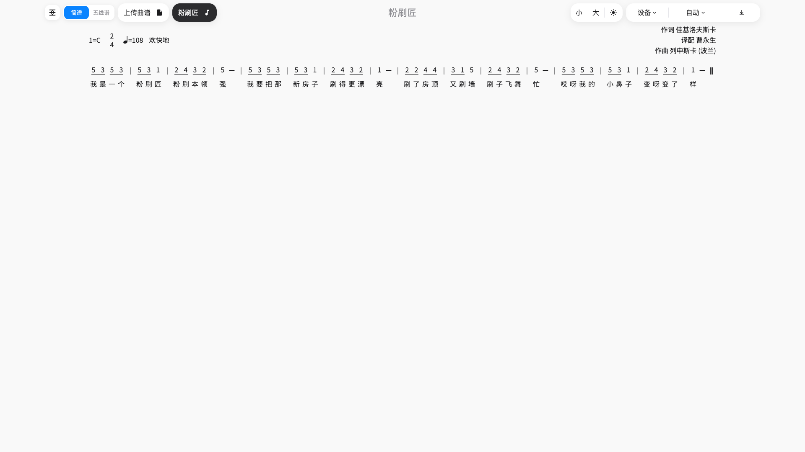
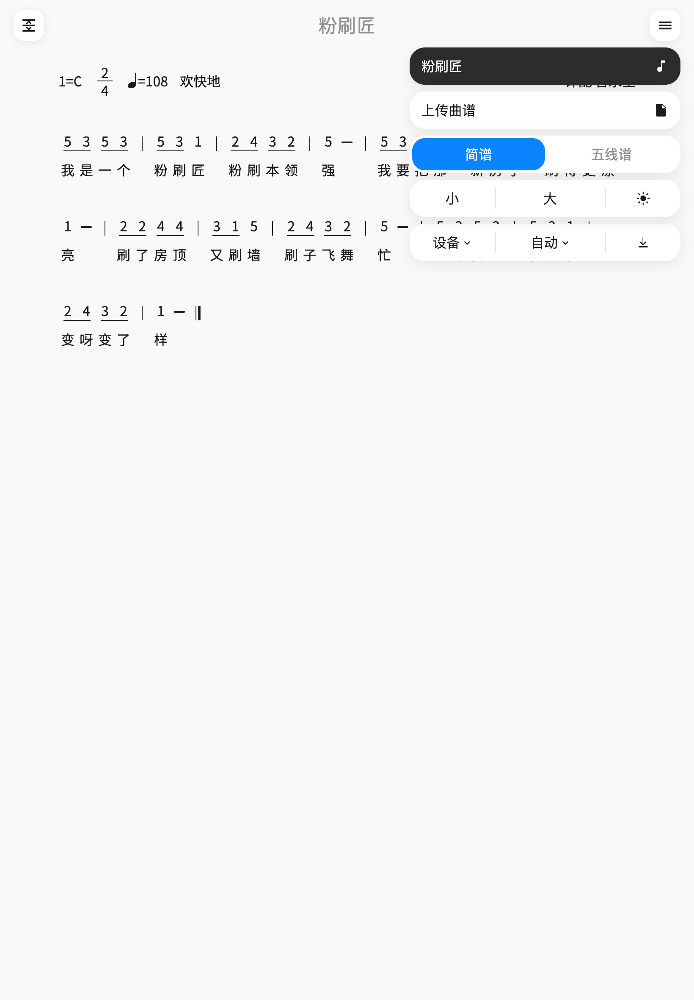
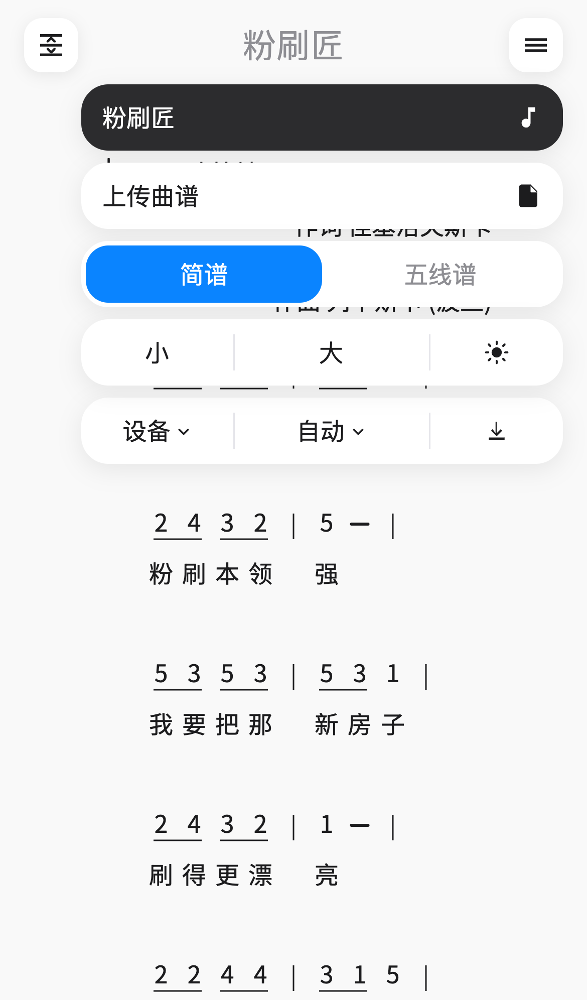

# xml2jianpu

**易谱**：将 [MusicXML](https://www.w3.org/2021/06/musicxml40/) 转为简谱（也可切到五线谱）。打开即可预览、试听，也可导出 PDF。

## 使用

### 访问与安装

#### 网页

打开 [GitHub Pages](https://sunbeamhub.github.io/xml2jianpu/)。

面向现代浏览器（Chrome / Edge / Firefox / Safari），**不支持 Internet Explorer**。大致兼容范围：

- **iOS**：Safari 11+。iOS 11–12 可预览与解析曲谱；导出 PDF 时可能需按应用内引导手动保存。
- **iPadOS**：13+。更早仍称 iOS 的 iPad（11–12）也可用网页。
- **macOS**：Safari 11+（约对应 10.12 Sierra 及更新）；也可用本机 Chrome / Edge / Firefox。
- **Android**：建议 8+，使用较新的 Chrome / Edge / Firefox；系统 WebView 过旧时可能异常。
- **Windows**：Windows 10+ 上的 Chrome / Edge / Firefox。
- **Linux**：近两年常见发行版上的 Chrome / Chromium / Firefox。

极旧 Safari 上捏合、拖拽或 PDF 导出可能较弱；上传、预览与基本操作仍是兼容目标。

#### 安装为应用（PWA）

在上述网页里，用浏览器把本站装到本机，以独立窗口打开。兼容范围与网页相同。

- **Chrome / Edge**（桌面或 Android）：地址栏或浏览器菜单里选「安装应用」。
- **Safari**（iPhone / iPad）：分享 → 添加到主屏幕。
- **第一次打开必须联网**，以便缓存界面、Noto Sans SC 字体和内置示例。之后即使断网，也可打开应用、切换内置示例、用「电子」音色试听并导出 PDF。钢琴采样不在预缓存里，第一次选用「钢琴」仍需联网。
- 自己上传的 MusicXML **不会**写入离线缓存：关掉页面或刷新后需要重新选择文件。


#### 原生安装包

从 [GitHub Releases](https://github.com/sunbeamhub/xml2jianpu/releases) 下载最新发布里对应平台的文件。


| 平台          | 文件                                                                                         | 兼容                                                                |
| ----------- | ------------------------------------------------------------------------------------------ | ----------------------------------------------------------------- |
| Windows 10+ | `yipu_{version}_windows_x64.msi` 或 `.exe`                                                  | 当前用户安装                                                            |
| macOS       | `yipu_{version}_macos_aarch64.dmg`（Apple Silicon）、`yipu_{version}_macos_x86_64.dmg`（Intel） | 按芯片选对应 dmg                                                        |
| Linux       | `.deb` / `.rpm` / AppImage（`yipu_{version}_linux_{arch}`）                                  | 近两年常见发行版                                                          |
| Android     | `yipu_{version}_android_aarch64.apk`（仅 arm64）                                              | 系统 7+（minSdk 24）；旧机请用系统 WebView ≈ Chrome 61（Android 8）的 release 包 |
| iOS         | `yipu_{version}_ios_aarch64.ipa`                                                           | 见下；普通用户请用网页或 PWA                                                  |


**macOS：dmg 能装进「应用程序」，从 GitHub 下载后第一次打开可能报「已损坏」。** 包没有坏，也不是「设置 → 隐私与安全性」里点「仍要打开」那种信任引导。在终端执行：

```bash
xattr -cr /Applications/易谱.app
```

然后再打开。芯片选错（Apple Silicon 用 `aarch64`，Intel 用 `x86_64`）也会打不开，但报错通常不是「已损坏」。

**iOS IPA 不是给普通用户装的。** 这是免费个人账号打出的 Development 包，不是 App Store / TestFlight / Ad Hoc：只能装到描述文件里登记过的设备，约 7 天过期。请改用 Safari 打开网页，或「添加到主屏幕」。

### 功能特性


#### 功能入口

桌面把指针移到标题栏，左侧会出现固定调移调、简谱/五线谱、上传和内置示例，右侧会出现字号、主题、纸张、换行和导出。试听在移调面板底部，不在标题栏上。

平板和手机默认只显示曲名；点**左上角**打开移调，点**右上角**打开功能菜单。点空白处或再点按钮可收起。







#### 主题

在标题栏或菜单里选浅色、深色，或跟随系统。下次打开沿用上次选择。


#### 固定调移调

桌面在标题栏左侧、平板和手机在左上角打开移调面板。进入后唱名按 `1=C` 重写，适合按 C 大调演奏。可用加减或滑杆按半音升降（上下限各一个八度），并一键还原原谱。谱面相对原谱有改动时图标会高亮。

面板底部可试听：播放或暂停，在音高轮廓上拖动进度，并在「电子」与「钢琴」之间切换音色。已进入固定调并改半音时，试听音高跟随当前移调。

此状态只在当前会话有效：换谱或刷新后回到 MusicXML 原调，播放位置和音色也不保留。导出 PDF 使用当前移调后的谱面。


#### 多列布局

桌面按视口自动分栏（最多 4 列），让长谱尽量落在一屏内；窗口宽高变化时会重新分栏。平板和手机保持单列。纸张为「设备」时，宽度变化会按当前屏幕重排。


#### 记谱切换

标题栏或菜单里的「简谱 / 五线谱」滑动开关：外框是圆角矩形，选中项为内部滑动色块。简谱用自研引擎，五线谱用 OpenSheetMusicDisplay。字号、换行、主题、移调、纸张在两种记谱下都会尽量套用。下次打开沿用上次选择。播放时简谱高亮当前拍，五线谱显示光标。高亮离开视口中部时纵向滚到中央；已在中部则不滚。手动滚动或滚轮后暂停跟随约 3 秒，再继续。

#### 上传曲谱

选择本地 `.musicxml` / `.xml`，即时排版。网页用文件选择器；Windows / macOS / Linux / Android / iOS 客户端走系统文件对话框。上传的谱只在当前会话，刷新或关掉后需要重新选择。

#### 内置示例

示例按专辑分组（儿歌、三色绘恋、电子琴启蒙1期等）。在列表里直接切换曲目即可预览。

#### 纸张大小

默认「设备」，跟随当前屏宽排版。也可改成 A4 或 A3 预览打印效果。导出 PDF 只用 A3 / A4 两种规格。

#### 换行

可选自动（按纸宽估算每行小节）、原谱换行，或固定每行 2–6 小节。

#### 字号

标题栏或菜单里的「小 / 大」调节唱名与歌词大小。点按后会出现当前档位圆点。

#### 缩放与平移

桌面用 Ctrl/Cmd + 滚轮（触控板捏合也会走这条）；平板和手机用双指捏合。放大后可横向拖动，纵向仍用页面滚动。放大后谱面超出视口时，试听跟谱也会把高亮横向移回视口中央。

#### 导出 PDF

纸张已是 A3/A4 时直接导出当前视图（简谱或五线谱）的矢量 PDF。「设备」预览时会先弹出纸张选择。简谱按「唱名 + 歌词」整组分页，不会把一行拆到两页。

#### 谱头与记谱

谱头显示调号（`1=`）、拍号、速度、表情术语，以及作词 / 译配 / 作曲。简谱将唱名与歌词对齐；时值下划线按拍分组；并绘制八度高低点、升降号与还原、附点、延音线、连线、休止符、小节线与终止线。未写 accidental 时按调号给出默认升降。

#### 偏好记忆

当前曲目、记谱方式、纸张、换行、字号、主题和上次导出纸张会记在浏览器本地，下次打开沿用。移调、音色和播放进度不写入本地。

## 开发

需要 **Node.js 20+**。克隆后执行 `npm install`。

发版标签必须是 `vMAJOR.MINOR.PATCH`，与 `[package.json](package.json)`、`[src-tauri/tauri.conf.json](src-tauri/tauri.conf.json)`、`[src-tauri/Cargo.toml](src-tauri/Cargo.toml)` 中的版本一致，且严格高于已有版本标签；`[CHANGELOG.md](CHANGELOG.md)` 里要有对应的 `## [x.y.z]` 章节（含条目）。`npm install` 会通过 husky 安装 `pre-push`：推送 `vX.Y.Z` 时先跑同一套校验（对照 **tag 指向的提交**，不是未保存的工作区）。不要用钩子自动 `version:bump`。

### 技术栈

- **界面**：Vue 3（Composition API + 单文件组件）
- **构建**：Vite 6；`browserslist` 面向 iOS/Safari 11+（`core-js` 补旧环境）；Web 开 PWA，Tauri 构建关 PWA
- **曲谱**：`fast-xml-parser` 读 MusicXML；简谱自研排版（`d3-selection` 绘 SVG）；五线谱 `opensheetmusicdisplay`；试听用 `tone`，钢琴采样在 `public/audio/piano/`（C1–C7）
- **导出**：`jspdf` + `svg2pdf.js` 矢量 PDF；屏幕字体 Noto Sans SC WOFF2，PDF 嵌同一套 TTF；五线谱乐谱字形不改写，避免节拍器等符号乱码
- **离线**：`vite-plugin-pwa` + `workbox-window`（仅 Web）
- **客户端**：[Tauri 2](https://v2.tauri.app/) + Rust，同一套前端打 Windows / macOS / Linux / Android / iOS；上传与导出走 `@tauri-apps/plugin-dialog`、`@tauri-apps/plugin-fs`
- **工程**：ESLint（vue3-essential）；husky 校验发版 tag；GitHub Actions 发 Pages 与 draft Release；EdgeOne Makers 跟随 `tauri` 分支做静态托管


### 本地调试


#### Web

```bash
npm install
npm run dev
```

浏览器打开 [http://localhost:5173/](http://localhost:5173/) 。`npm run build` 产物在 `dist/`。

#### 桌面（Windows / macOS / Linux）

先安装 [Tauri 前置依赖](https://v2.tauri.app/start/prerequisites/)：Node.js 20+、Rust stable。Linux 还需要 `webkit2gtk` 等系统库。Debian / Ubuntu 示例：

```bash
sudo apt update
sudo apt install libwebkit2gtk-4.1-dev build-essential curl wget file \
  libxdo-dev libssl-dev libayatana-appindicator3-dev librsvg2-dev
```

```bash
npm run tauri:dev        # 桌面
npm run tauri:dev:warm   # 首次或清缓存后，先预构建 Vite 依赖
```


#### Android

安装 Android Studio、SDK、NDK；设置 `JAVA_HOME`（**建议 JDK 17**，不要用 Java 8 或 Android Studio 自带的 JDK 25）、`ANDROID_HOME`、`NDK_HOME`。`tauri android init` 生成的 `src-tauri/gen/` 需要提交到 Git（含对 `MainActivity.kt`、`themes.xml` 等的修改）。不要提交 `src-tauri/target/`、`src-tauri/gen/android/build/`、`.gradle/`、签名密钥（`keystore.properties`、`*.jks`）。

```bash
npm run tauri android init -- --ci   # 仅首次
npm run icon:all                     # android init 之后同步图标；会覆盖桌面 icns/ico/png，不改 iOS 方图
npm run tauri:android:dev            # 真机 / 模拟器
```

`tauri:android:dev` **不转译现代 JS**，Android 8 / 旧 WebView 会报 `globalThis`、`Unexpected token .` 等错误。旧机请装 release APK：

```bash
./scripts/setup-android-signing.sh   # 生成本地 keystore（不提交 Git）
npm run tauri:android:build
```

产物：`src-tauri/gen/android/app/build/outputs/apk/universal/release/yipu_{version}_android_aarch64.apk`（仅 arm64）。未签名时部分系统会报「packageInfo is null」。

#### iOS

仅 macOS。需要 Xcode、CocoaPods。复制 `[.env.example](.env.example)` 为 `.env` 并填写 `APPLE_DEVELOPMENT_TEAM`。`tauri ios init` 生成的 `src-tauri/gen/apple/` 同样需要提交。最低系统 **iOS 13+**。

```bash
npm run tauri:ios:dev    # 模拟器，或本机 Xcode 已连过的真机
```

**本地 IPA 限制：** `npm run tauri:ios:build -- --export-method debugging` 打出的是 Development 包，**不是** Ad Hoc / App Store / TestFlight。IPA 只能装到该描述文件里登记过的设备（通常就是本机 Xcode Run 过的那台）。用 Finder / Apple Configurator / Xcode 安装后，还要在设备 **设置 → 通用 → VPN 与设备管理** 信任开发者。

免费个人账号的描述文件大约 **7 天过期**。过期后应用无法打开，需再用 Xcode 连真机签一次。不要去 Apple Developer 网站创建 Profile。

### Fork 与发布部署

Fork 后请改自己的 GitHub Pages 环境与仓库 Secrets。仓库名若不是 `xml2jianpu`，要改 `npm run build:pages` 使用的 `PUBLIC_PATH`。若要发布自己的安装包，还需改 identifier `com.sunbeamhub.xml2jianpu`。GitHub Release 默认是 **draft**，需在网页上手动发布，用户才能下载。应用和网页里的「关于」只对比已发布的 Release；草稿期间检测不到更新。桌面和 Android 的「立即更新」会打开对应安装包，需自行安装，不是应用内替换。

发版流程：把改动写进 `CHANGELOG.md` 的 `[Unreleased]`，再提升版本、打 tag 推送：

```bash
npm run version:bump -- 0.0.2   # 把 Unreleased 提升为 ## [0.0.2]，并升工程版本
git add -A && git commit -m "chore: 发布 0.0.2"
git tag v0.0.2
git push origin tauri v0.0.2
```

误推的标签不会发布，需手动删除后再推新标签：`git push origin :refs/tags/v0.0.2`。

推送 `vMAJOR.MINOR.PATCH` 会同时触发 `[.github/workflows/deploy.yml](.github/workflows/deploy.yml)`（GitHub Pages）和 `[.github/workflows/release.yml](.github/workflows/release.yml)`（桌面 / Android / iOS 安装包，挂到同一条 draft Release）。EdgeOne 只跟 `tauri` 分支，不跟 tag。

#### Web：GitHub Pages

1. 仓库 Settings → Pages：Source 选 **GitHub Actions**。
2. Settings → Environments → **github-pages** → Deployment branches and tags：允许 Tag `v*.*.`*（建议同时允许 Branch `tauri`，便于手动 `workflow_dispatch`）。默认往往只允许默认分支，tag 发版会被环境规则拒绝。
3. 构建执行 `npm run build:pages`（`PUBLIC_PATH=/xml2jianpu/`），以适配 GitHub Pages 子路径。
4. 完成后访问：[https://sunbeamhub.github.io/xml2jianpu/](https://sunbeamhub.github.io/xml2jianpu/)


#### Web：腾讯云 EdgeOne Makers

用于开发者在大陆验证，**没有写入用户访问入口的稳定公开域名**。打开 [EdgeOne Makers 控制台](https://console.cloud.tencent.com/edgeone/pages)，开通免费版并连接 GitHub 仓库；Production 分支选 `tauri`。构建由根目录 `[edgeone.json](edgeone.json)` 配置（`npm run build` → `dist`，站点根路径，不必设 `PUBLIC_PATH`）。**访问地址以控制台给出的默认域名为准**。只监听 `tauri` 分支推送。

#### 桌面

同一条 tag 构建 Windows / macOS / Linux 安装包，文件名 `yipu_{version}_{os}_{arch}`。CI 的 macOS 包不做 Developer ID 签名、也不公证，因此没有系统「仍要打开」引导；用户侧解除隔离见上文。

#### Android

同一条 tag。需在仓库 Secrets 配置 `ANDROID_KEY_BASE64`、`ANDROID_KEY_ALIAS`、`ANDROID_KEY_PASSWORD` 才会签名，否则 APK 无法在真机安装。CI 会自动 `android init`；产物仅 aarch64。本地签名见 [Tauri Android 签名文档](https://v2.tauri.app/distribute/signing/android/)。

#### iOS

**发布用的 IPA 与本地 debugging 包是同一类限制**：CI 执行 `npm run tauri:ios:build -- --export-method debugging`，不是 Ad Hoc / App Store / TestFlight。用户无法当普通 iOS App 安装；只能装到描述文件登记过的设备，并用 Finder / Apple Configurator / Xcode 安装，然后在 **设置 → 通用 → VPN 与设备管理** 信任开发者。

仓库 Secrets（不要提交证书文件）：

- `APPLE_DEVELOPMENT_TEAM`：10 位 Team ID（与本机 `.env` 一致）
- `IOS_CERTIFICATE`：钥匙串导出的 Apple Development `.p12` 的 Base64
- `IOS_CERTIFICATE_PASSWORD`：导出 p12 时设的密码
- `IOS_MOBILE_PROVISION`：本机 Xcode 为 `com.sunbeamhub.xml2jianpu` 生成的 `.mobileprovision` 的 Base64（**不要去 Apple Developer 网站建 Profile**）

描述文件大约 **7 天过期**。到期后用 Xcode 再连真机 Run 一次，重新 `base64` 该 profile，在 GitHub 覆盖 `IOS_MOBILE_PROVISION`。不更新则 CI 编不出可安装 IPA。